# Phase 0 — Current State of `neuromem-sdk`

*Baseline audit. Every later recommendation in this research program MUST trace back to a component listed here (to improve) or an absent one (to add).*

**Repo snapshot.** `neuromem-sdk v0.3.2`, MIT, Python 3.9+, ~9,200 LOC in `neuromem/`, ~3,900 LOC in `tests/`, published on PyPI as `neuromem-sdk`, packaged by setuptools, authors listed as "NeuroMem Team". Current git branch `main`, clean working tree, last release tag references `v0.3.2` (commit `04f01c2`).

**Scope of this document.** Everything that exists on disk *today*. No aspirations, no marketing. Where README and source diverge, source wins.

---

## 1. Stack ground truth (vs. mission-brief assumptions)

The mission brief stipulates a pgvector-on-Postgres primary. **That is not what is installed.**

| Layer | Mission brief assumption | What the repo actually ships |
| --- | --- | --- |
| Vector store (primary) | pgvector | **pgvector-in-Postgres** and **Qdrant** are peer optional extras; **in-memory** is the default in `neuromem.yaml` (`storage.database.type: memory`) |
| Graph / temporal | Postgres AGE or JSONB | **In-process Python dict graph** (`MemoryGraph`) — not persisted to any DB |
| Orchestration | LangChain / LangGraph, must plug into `BaseStore` + checkpointer | LangChain + LangGraph **adapters exist as node-factory wrappers**; a `NeuroMemStore` class is referenced in `neuromem/adapters/langgraph.py` docstring but **not implemented** (no class in file; `__all__` exports only `with_memory`, `create_memory_node`, `create_observation_node`, `create_memory_agent_node`) |
| Async runtime | `asyncio` + Pydantic v2 | **Threading-based** (`ThreadPoolExecutor`, `PriorityTaskScheduler`, daemon workers). Optional Inngest workflow path. Pydantic is declared in the `mcp` extra only. Top-level types are stdlib `dataclass`, not Pydantic. |
| Deployment envelope | Cloud Run + Docker + GH Actions | No Dockerfile or Cloud Run manifest in repo. GH Actions workflow exists at `.github/workflows/ci-cd.yml`. |
| Packaging | PyPI OIDC Trusted Publishing | Confirmed in CI (per project memory). |

**Implication for later phases.** The SDK is *not* currently a Postgres-native service. It is a Python library with a Protocol-based storage backend and in-memory defaults. Any Phase-6 proposal that assumes pgvector-is-there-already is wrong. Flag every such item.

---

## 2. Public API surface

The user import surface from `neuromem/__init__.py`:

```python
from neuromem import NeuroMem, NeuroMemConfig, User, UserManager
from neuromem import (
    MemoryItem, MemoryType,          # core types
    MemoryController,                 # orchestrator
    RetrievalEngine, Consolidator, DecayEngine,
    EpisodicMemory, SemanticMemory, ProceduralMemory, SessionMemory,
    MemoryBackend,                    # storage Protocol
)
```

`NeuroMem` is a facade. Every `for_<framework>()` classmethod is an alias for `from_config`. The actual methods on a `NeuroMem` instance:

| Method | Purpose | Calls into |
| --- | --- | --- |
| `observe(user_input, assistant_output, template, metadata, max_content_length)` | Store a turn as episodic + verbatim + graph register | `MemoryController.observe` |
| `retrieve(query, task_type, k, parallel)` | Multi-hop-aware retrieval | `MemoryController.retrieve_multihop` |
| `retrieve_with_context(query, task_type, k)` | Retrieve + graph context expansion | `MemoryController.retrieve(expand_context=True)` |
| `retrieve_verbatim_only(query, k, bm25_blend, ce_blend, ce_top_k)` | Deterministic 2-stage retrieval against verbatim chunks only | `MemoryController.retrieve_verbatim_only` |
| `search(query_string, k)` | Structured-query syntax (`type:`, `tag:`, `after:`, etc.) | `MemoryQuery` + `controller.retrieve` |
| `consolidate()` | Episodic → semantic/procedural promotion | `Consolidator` + `ConsolidationEngine` |
| `list(memory_type, limit)` | List memories | controller |
| `update(memory_id, content)` / `forget(memory_id)` | CRUD | controller |
| `explain(memory_id)` | Retrieval-attribution dict | controller |
| `reinforce(memory_id, reward, task_type)` | TD-learning feedback (brain-only) | `BrainSystem.reinforce` |
| `get_working_memory()` | Read PFC slot contents (brain-only) | `BrainSystem.get_working_memory_ids` |
| `observe_multimodal(...)` | Multimodal observe (currently falls back to text) | `observe` |
| `get_graph()` | Export `{nodes, edges}` | `MemoryGraph.export` |
| `get_context(max_level, topic, query)` | L0-L3 layered context load | `ContextManager` |
| `find_by_tags(tag_prefix, limit)`, `get_tag_tree()` | Tag hierarchy queries | controller |
| `get_memories_by_date(date)`, `get_memories_in_range(start, end)` | Temporal queries | controller |
| `daily_summary(date)`, `weekly_digest(week_start)` | LLM-generated summaries | `TemporalSummarizer` |
| `close()` | Release backend handles | `MemoryController.shutdown` via `__del__` |

---

## 3. Architecture (Mermaid)

```mermaid
flowchart TB
    subgraph Facade["NeuroMem (Facade)"]
        NM["NeuroMem\nfrom_config()\nfor_langchain/… ()"]
    end

    subgraph Controller["MemoryController (orchestrator)"]
        OBS[observe]
        RET[retrieve / retrieve_multihop]
        CONS[consolidate]
        POL[Policies]
        GRF[(MemoryGraph\nin-process)]
    end

    subgraph Layers["Memory layers"]
        EP[EpisodicMemory]
        SE[SemanticMemory]
        PR[ProceduralMemory]
        SS[SessionMemory\nRAM-only deque]
        VB[VerbatimStore\nv0.4.0 raw chunks]
    end

    subgraph Engines["Cognitive engines"]
        RE[RetrievalEngine\nscoring + inhibition]
        DE[DecayEngine\nEbbinghaus]
        CO[Consolidator\nLLM fact-extract]
        HR[HybridRetrieval\nsalience/recency/sim]
        HB[hybrid_boosts\nkw/quoted/person/temporal]
        BM[BM25Scorer]
        CE[cross_encoder_reranker]
        LL[llm_reranker\noptional]
        HY[HyDE\nuser-voice]
        TS[PriorityTaskScheduler\n5 queues]
        IW[IngestWorker\ndaemon]
        MW[MaintenanceWorker\ndaemon]
        CM[ContextManager\nL0-L3]
        TD[topic_detector]
        QX[query_expansion]
    end

    subgraph Brain["brain/ (v0.3.0, config-gated)"]
        BS[BrainSystem facade]
        PS[PatternSeparator\nDG sparse RP]
        PC[PatternCompleter\nCA3]
        C1[CA1Gate\nvalue-based]
        WM[WorkingMemoryBuffer\nCowan 4]
        ET[EmotionalTagger\namygdala]
        SI[SchemaIntegrator\nneocortex]
        TL[TDLearner\nbasal ganglia]
        BSS[BrainStateStore\nJSON sidecar]
    end

    subgraph Storage["MemoryBackend (Protocol)"]
        IM[InMemoryBackend]
        PG[PostgresBackend\npsycopg2 + pgvector]
        QD[QdrantStorage\nqdrant-client]
        SQ[SQLiteBackend]
    end

    subgraph Multimodal["multimodal/ (v0.3.0, optional)"]
        EN[encoders/]
        FU[fusion/]
        LK[livekit/]
        RT[router.py]
    end

    subgraph Adapters["adapters/ (lazy)"]
        LC[langchain\nRunnable+ChatHistory]
        LG[langgraph\nnode factories\nNO BaseStore class]
        LE[litellm]
        CR[crewai]
        AG[autogen / ag2]
        DS[dspy]
        HA[haystack]
        SK[semantic-kernel]
    end

    subgraph MCP["mcp/ (stdio + HTTP)"]
        MS[server.py\n12 tools / 3 res / 2 prompts]
    end

    subgraph Workflows["workflows/ (optional)"]
        INN[Inngest functions\ncron consolidation/decay/opt]
    end

    NM --> Controller
    OBS --> Layers
    OBS --> GRF
    OBS --> BS
    RET --> Layers
    RET --> Engines
    RET --> BS
    CONS --> EP
    CONS --> SE
    CONS --> PR
    POL --> GRF

    Engines -.-> RE
    Engines -.-> DE
    Engines -.-> CO
    Engines -.-> HR
    Engines -.-> HB
    Engines -.-> BM
    Engines -.-> CE
    Engines -.-> LL
    Engines -.-> HY
    Engines -.-> TS
    Engines -.-> IW
    Engines -.-> MW
    Engines -.-> CM
    Engines -.-> TD
    Engines -.-> QX

    Brain -.-> BS
    Brain -.-> PS
    Brain -.-> PC
    Brain -.-> C1
    Brain -.-> WM
    Brain -.-> ET
    Brain -.-> SI
    Brain -.-> TL
    Brain -.-> BSS

    Layers --> Storage
    IW -. enqueues .-> TS
    MW -. drains .-> TS

    NM --> Adapters
    NM --> MCP
    NM --> Workflows
    NM --> Multimodal
```



---

## 4. Memory layers

| Layer | File | Storage | Persistence | Role |
| --- | --- | --- | --- | --- |
| Episodic | `memory/episodic.py` | `MemoryBackend` | Yes | Recent user↔assistant turns; `memory_type=EPISODIC` filter on backend |
| Semantic | `memory/semantic.py` | `MemoryBackend` | Yes | Facts consolidated from episodic via LLM extraction |
| Procedural | `memory/procedural.py` | `MemoryBackend` | Yes | User style patterns; includes `extract_style_profile()` heuristic on messages |
| Session | `memory/session.py` | `collections.deque(maxlen=20)` | **No** (RAM) | Current-turn rolling window; NOT tied to brain `WorkingMemoryBuffer` |
| Verbatim (v0.4.0) | `core/verbatim.py` | Re-uses episodic backend with `store_type=verbatim_chunk` metadata sentinel | Yes | Raw overlapping-chunk copies; `salience=0.85`, `confidence=1.0`, `decay_rate=0.0`, `editable=False` |
| Working (brain) | `brain/prefrontal/working_memory.py` | In-process list of `(id, score)` tuples, persisted via `BrainStateStore` JSON sidecar | Sidecar only | Capacity 4 (Cowan); attention-gated write; not a peer `MemoryType` in the backend |
| Affective | `MemoryType.AFFECTIVE` exists in enum | — | — | **Declared but unused** — no affective-memory layer, no code path writes this type |

**Observation.** `SessionMemory` and `WorkingMemoryBuffer` both claim the "working memory" role but are unlinked from each other. The enum has `WORKING` and `AFFECTIVE` reserved but no layer materialises them on the backend.

---

## 5. `MemoryBackend` Protocol (`storage/base.py`)

```python
class MemoryBackend(Protocol):
    def upsert(item: MemoryItem) -> None
    def query(embedding, filters, k) -> (List[MemoryItem], List[float])
    def get_by_id(item_id) -> MemoryItem | None
    def update(item) -> None
    def delete(item_id) -> bool
    def list_all(user_id, memory_type=None, limit=100) -> List[MemoryItem]
```

Five implementations present:

| Backend | File | LOC | Status |
| --- | --- | --- | --- |
| `InMemoryBackend` | `storage/memory.py` | 137 | Default in shipped yaml |
| `PostgresBackend` | `storage/postgres.py` | 370 | `psycopg2-binary` + `pgvector` extension, `ThreadedConnectionPool(1, 10)`, schema auto-created |
| `QdrantStorage` | `storage/qdrant.py` | 235 | `qdrant-client >= 1.17` (query_points API); cosine distance |
| `SQLiteBackend` | `storage/sqlite.py` | 280 | Local dev |
| (Chroma, Redis) | — | — | Mentioned in yaml comments; **not implemented** |

The Protocol does not define: embedding dimensionality, transactional batch writes, async variants, or time-range queries (`get_memories_in_range` scans `list_all(limit=1000)` at the controller level). No index on `created_at`. These become Phase-6 concerns.

---

## 6. Retrieval pipeline

This is the most mature part of the codebase. Two distinct paths:

### 6.1 Cognitive path — `MemoryController.retrieve()`
1. Parallel retrieval across semantic/procedural/episodic (3-worker `ThreadPoolExecutor`, persistent).
2. Merge with verbatim results (content-keyed dedup; verbatim wins ties because `salience=0.85, confidence=1.0`).
3. `HybridRetrieval` (recency × salience × similarity) re-ranks a pool of `max(k*3, 30)`.
4. `apply_hybrid_boosts` — keyword overlap, quoted phrase, proper-noun, temporal.
5. `BM25Scorer.normalized_score` blended with similarity at configurable `bm25_blend` (default 0.5).
6. `rerank_with_cross_encoder` on top-30 at `ce_blend` (default 0.9) — this is the precision step.
7. Optional `llm_rerank` on top-5 (gated by `retrieval.llm_rerank_enabled`).
8. Keyword fallback when `max(all_sims) < 0.7`.
9. `conflict_resolver.detect_conflict` + `resolve` — content-overlap + negation asymmetry heuristic (≥3 shared words, ≥40% overlap, XOR negation).
10. `BrainSystem.on_retrieve` → `CA1Gate.gate` (value-based re-ranking using TD values).
11. `reconsolidation_policy.update_memory_after_retrieval` updates `RetrievalStats`; optionally triggers reconsolidation if `retrieval_count >= 3` and new context is ≥1.5× content length.
12. Optional graph context expansion (`graph.get_related(item.id, depth=1)`, top 3 neighbours).

### 6.2 Verbatim-only path — `MemoryController.retrieve_verbatim_only()`
Deterministic 2-stage pipeline introduced as the MemBench-winning configuration:
1. `VerbatimStore.query` (embedding on verbatim chunks).
2. BM25 blend at `bm25_blend`.
3. Cross-encoder rerank on top-30.
4. Return top-k. **No cognitive layers, no conflict resolution, no brain gating, no reconsolidation, no decay touch.**

### 6.3 Multi-hop — `MemoryController.retrieve_multihop()`
1. Heuristic `_is_multi_hop_query` (tokens `both`, `and also`, `vs`, compound temporal markers, "X and Y" proper-noun pattern).
2. LLM decomposition via `gpt-4o-mini` — prompt asks for independent sub-questions.
3. Cap at 3 sub-queries; per-query `k = max(k/n, 3)`.
4. For weak sub-results, `_graph_retrieve` fallback using entity index + graph traversal (HippoRAG-style).
5. RRF (`_rrf_merge`) helper present but called only externally — **default multihop path uses plain dedup, not RRF.**

**What's already commodity-class here:**
- Cross-encoder reranking (the industry gold standard)
- BM25 hybrid (matches Anthropic's Contextual Retrieval recipe minus contextual prefix)
- Configurable per-workload blend weights
- HyDE support (`core/hyde.py`) with persistent disk+memory cache

**What's absent that SOTA would expect:**
- No contextual-chunk embedding (no prepending chunk context before embedding à la Anthropic Contextual Retrieval).
- No reranker-aware query expansion (present file `query_expansion.py` is a standalone helper not in the default retrieve path — verify in Phase 5).
- No PageRank / Personalized PageRank over the graph (HippoRAG core trick). `_graph_retrieve` does BFS only.
- No long-context fallback strategy (nothing that decides "stuff it all in" vs. RAG based on query length).

---

## 7. Brain system (`brain/`, v0.3.0, config-gated)

Gated on `brain.enabled: true` (default `False`). All hooks wrapped in `try/except` — the brain is an enhancement layer that must never break the core pipeline (enforced via memory `feedback_brain_implementation.md`).

| Region | File | LOC | What it does |
| --- | --- | --- | --- |
| DG — pattern separation | `hippocampus/pattern_separation.py` | 125 | Sparse random projection (Achlioptas 2003), 4× expansion, k-WTA with `sparsity=0.05`, seeded per `user_id` |
| CA3 — pattern completion | `hippocampus/pattern_completion.py` | 114 | Attractor re-weighting over candidates (no separate index) |
| CA1 — output gating | `hippocampus/ca1_gate.py` | 97 | Value-based re-rank using TD values + working-memory hot-set |
| PFC — working memory | `prefrontal/working_memory.py` | 112 | 4-slot capacity, attention-gated write, displaced-min replacement |
| Amygdala | `amygdala/emotional_tagger.py` | 167 | Valence/arousal heuristic, flashbulb flag above arousal threshold (0.8), adjusts salience + decay |
| Basal ganglia — TD | `basal_ganglia/td_learner.py` | 117 | TD(0) style, α=0.1, γ=0.9, `cluster_id` bucketing |
| Neocortex — schema | `neocortex/schema_integrator.py` | 177 | Congruence to running centroids, boosts salience by `schema_boost` |
| Facade | `brain/system.py` | 210 | Wires all regions into `on_observe` / `on_retrieve` / `reinforce` |
| State store | `brain/state_store.py` | 77 | JSON sidecar persistence of `BrainState` (WM slots, TD values, schema centroids) |

**What it implements vs. what names imply.**
- "Pattern separation" is a sparse random projection — a reasonable *implementation* of DG-like separation but purely feed-forward, no learned competition between granule cells, no dentate gyrus-style gap junctions.
- "Pattern completion" does not build a separate attractor index; it re-weights retrieval candidates against an attractor reference, which is closer to re-ranking than to Hopfield-style completion.
- "Systems consolidation / sleep replay" — **not present in code** despite the memory note referencing replay. `hippocampus/__init__.py` exports only `ca1_gate`, `pattern_completion`, `pattern_separation`. Also `ripple_interval_minutes` / `ripple_batch_size` are in the default `brain()` config **but no module consumes them**.
- Flashbulb memory is enforced in `DecayEngine.calculate_decay` via `item.metadata.get("flashbulb", False)` — a real cross-module hook.

---

## 8. Policies (`core/policies/`)

| Policy | File | Status | Summary |
| --- | --- | --- | --- |
| `ReconsolidationPolicy` | `reconsolidation.py` | Active | Triggers when `retrieval_count ≥ 3` and new context `> 1.5×` content length. Updates `RetrievalStats` EMA of similarity. Merge is naïve append (`"Additional context: …"`). |
| `ConflictResolver` | `conflict_resolution.py` | Active | Content-overlap + negation-asymmetry heuristic. Resolution is weighted sum of recency / confidence / reinforcement (`0.4 / 0.3 / 0.3`). Marks loser `deprecated=True`, adds `contradicts` graph link. |
| `salience.py` | Present | Not read in Phase 0 | — |
| `optimization.py` | Present | Not read in Phase 0 | — |

---

## 9. Consolidation

`core/consolidation.py` → `Consolidator` → `memory/consolidation.py` → `ConsolidationEngine` (335 LOC, not read in detail).

- Triggered from `NeuroMem.observe()` every `consolidation_interval` turns (default 10).
- `DecayEngine.schedule_consolidation(episodic_items, days_threshold=0)` — **zero-day default**: any existing episodic memory is eligible the moment you consolidate. This is fast-compile, not CLS-slow.
- LLM-driven (`gpt-4o-mini` default) — extracts facts → new `SEMANTIC` memories with `salience=0.8, confidence=fact["confidence"]`; creates summaries → also stored as `SEMANTIC` with `decay_rate=0.02`.
- Graph links: every consolidated semantic memory gets `derived_from` links back to its source episodic memories.
- Embeddings for new memories batched in a single call when possible.

**Gap vs. CLS.** No interleaving with existing semantic memories; no replay of old-plus-new; no spaced schedule. Consolidation is immediate fact-extraction, not slow neocortical integration.

---

## 10. Decay (`core/decay.py`)

Ebbinghaus exponential: `strength = e^(-adjusted_decay_rate * days)`, where
`adjusted_decay_rate = decay_rate / (1 + ln(1 + reinforcement))` and is further scaled by `(1 - salience * 0.5)`.

- `should_forget(threshold=0.1)` → delete candidate.
- **Flashbulb override** — `metadata["flashbulb"] = True` means `strength = 1.0` and `should_forget = False` unconditionally.
- `reinforce(item)` bumps `last_accessed` to now and `reinforcement += 1`. This is called in two places: `DecayEngine.reinforce` (from controller retrieve loop) **and** `ReconsolidationPolicy.update_memory_after_retrieval` (also called in the same retrieve loop). Net effect: `reinforcement` increments by 2 per retrieval. Double-counting is likely a bug — flag for Phase 5/6.
- `get_retention_period` gives an analytical `-ln(threshold)/rate` days.

---

## 11. Graph (`core/graph.py`, 499 LOC)

An **in-process Python dict graph**, not backed by any DB. Lost on process exit unless brain state or consolidation re-links.

- Forward + reverse adjacency maps.
- Entity index: `_entity_index[entity_lower] = set(memory_ids)`.
- `extract_entities(text)` — regex proper-noun heuristic with stop-entity set; runs inline during `observe` at claimed <1ms.
- Operations: `add_link`, `remove_link`, `remove_all_links`, `get_links`, `get_backlinks`, `get_related(depth=1)` (BFS), `get_clusters` (Union-Find), `get_bridge_memories`, `find_memories_by_entity`, `get_entity_connected_memories`.
- **Temporal KG (v0.4.0)** — `valid_from`/`valid_to` fields on `MemoryLink`, plus `invalidate`, `query_as_of`, `timeline` methods. This is bi-temporal in spirit but unpersisted.
- 5 link types: `derived_from`, `contradicts`, `reinforces`, `related`, `supersedes`.

**Gap.** No PageRank, no Personalized PageRank, no community detection beyond connected components, no persisted graph store (so: no graph-scale SQL or AGE queries), and graph state dies with the process.

---

## 12. Async & workers (`core/task_scheduler.py`, `core/workers/`)

- 5-priority `PriorityTaskScheduler` (CRITICAL / HIGH / MEDIUM / LOW / BACKGROUND) with per-level queue size caps and a `salience_threshold=0.7` guard against dropping important tasks.
- `IngestWorker` and `MaintenanceWorker` are daemon threads — NOT `asyncio`.
- Enabled by default (`async.enabled: true` in default config); `observe` enqueues with priority CRITICAL.
- Inngest path (`workflows/`, 626 LOC in `functions.py`) is an **alternative** to threading workers, gated on `workflows.enabled`.

---

## 13. Adapters (`adapters/`, 2,170 LOC incl. `__init__`)

All lazy-imported in `adapters/__init__.py`, wrapped in `try/except (ImportError, NameError, TypeError)`.

| Adapter | File | Exposed | BaseStore / equivalent? |
| --- | --- | --- | --- |
| LangChain | `langchain.py` (420) | `NeuroMemRunnable`, `NeuroMemChatMessageHistory`, `add_memory`, `NeuroMemLangChain`, `LangChainMemoryAdapter` | `ChatMessageHistory` yes; no LangChain `BaseStore` |
| LangGraph | `langgraph.py` (417) | `with_memory`, `create_memory_node`, `create_observation_node`, `create_memory_agent_node` | **`NeuroMemStore` / `BaseStore` mentioned in docstring but NOT implemented** — no class definition in the file, not in `__all__` |
| LiteLLM | `litellm.py` (276) | `NeuroMemLiteLLM`, `completion_with_memory`, `acompletion_with_memory` | N/A |
| CrewAI | `crewai.py` (252) | 4 `BaseTool` subclasses + `create_neuromem_tools` | N/A |
| AutoGen / AG2 | `autogen.py` (205) | `register_neuromem_tools`, `NeuroMemCapability` | N/A |
| DSPy | `dspy.py` (196) | `NeuroMemRetriever`, `MemoryAugmentedQA`, `create_neuromem_tools` | N/A |
| Haystack | `haystack.py` (202) | `NeuroMemRetriever`, `NeuroMemWriter`, `NeuroMemContextRetriever` | N/A |
| Semantic Kernel | `semantic_kernel.py` (207) | `NeuroMemPlugin`, `create_neuromem_plugin` | N/A |

**Claim check vs README**: README advertises "8 framework adapters" and "MCP server" — confirmed.

---

## 14. MCP server (`mcp/`, 507 LOC server)

- `neuromem.mcp` is registered as a console script entry point (`neuromem-mcp`).
- FastMCP 1.26+.
- 12 tools (per README, consistent with memory `project_mcp_server_phase1.md`): `store_memory`, `search_memories`, `search_advanced`, `get_context`, `get_memory`, `list_memories`, `update_memory`, `delete_memory`, `consolidate`, `get_stats`, `find_by_tags`, `get_graph`.
- stdio and HTTP transports.

---

## 15. Multimodal (`multimodal/`, v0.3.0, optional)

Structure:
- `encoders/` — text, audio, video encoders (lazy-loaded; `torch`, `whisper`, `transformers`, `soundfile`, `Pillow` extras).
- `fusion/` — late-fusion router.
- `livekit/` — LiveKit bridge (per memory `reference_livekit_integration.md`).
- `router.py`, `types.py`, `errors.py`.

API surface exposed on `NeuroMem`:
- `observe_multimodal(text, audio_bytes, video_frames, assistant_output, source)` — **currently falls back to text-only** (the implementation comment says "For now, fall back to text-only if text is available"). Audio/video inputs are not actually encoded into embeddings in the shipped path.
- `for_livekit(user_id, config_path)` — another `from_config` alias.

---

## 16. Benchmarks (`benchmarks/`)

- Adapters for `neuromem`, `mempalace`, `mem0`, `langmem`, `zep`.
- Runners for `membench`, `longmemeval`, `convomem`, `locomo`, `latency`.
- Scoring modules: `llm_judge`, `metrics` (under `benchmarks/` scoring tree).
- Published v0.3.2 numbers vs MemPalace (from README): MemBench R@5 **97.0% / 87.9%**, LongMemEval **98.0% / 94.0%**, ConvoMem **81.3% / 80.7%**.

This is a first-class asset. Phase 6 roadmap items can all be held to these harnesses.

---

## 17. Config surface (`neuromem/config.py`)

`NeuroMemConfig` methods, each returning a dict with safe defaults if the section is absent:
`model()`, `storage()`, `memory()`, `consolidation()`, `embeddings()`, `tagging()`, `retrieval()`, `verbatim()`, `brain()`, `multimodal()`, `livekit()`, `workflows()`, `get(key, default)`.

Notable retrieval knobs (used by controller):
- `retrieval.hybrid_enabled` (default True via default-dict), `similarity_weight`, `salience_weight`, `recency_weight`, `reinforcement_weight`, `confidence_weight`, `recency_half_life_days`.
- `retrieval.bm25_blend` (default 0.5), `retrieval.ce_blend` (default 0.9).
- `retrieval.llm_rerank_enabled`, `llm_rerank_model`, `llm_rerank_provider`, `llm_rerank_blend`.

The shipped `neuromem.yaml` at repo root has `vector_store.type: memory` — not `pgvector` — with Chroma and Redis listed only as comment options.

---

## 18. Tests (`tests/`)

| Suite | File | LOC |
| --- | --- | --- |
| Core memory / retrieval / decay | `test_core.py` | 154 |
| Graph | `test_graph.py` | 267 |
| Structured query | `test_query.py` | 337 |
| BM25 scorer | `test_bm25_scorer.py` | 92 |
| Hybrid boosts | `test_hybrid_boosts.py` | 296 |
| Verbatim | `test_verbatim.py` | 315 |
| Brain | `test_brain.py` | 440 |
| Multimodal | `test_multimodal.py` | 220 |
| MCP | `test_mcp.py` | 333 |
| Workflows | `test_workflows.py` | 308 |
| Benchmark runners | `test_benchmark_runners.py` | 440 |
| CrewAI / AutoGen / DSPy / Haystack / Semantic Kernel adapters | 5 files | 125+96+112+134+122 = 589 |
| **Total** | 14 files | **3,906** |

README claims "176 tests total". Not verified by running `pytest` in Phase 0 (no test execution scoped).

---

## 19. Feature inventory

| Feature | Present? | Backend(s) | Notes |
| --- | --- | --- | --- |
| Episodic / semantic / procedural layers | ✅ | in-memory / pg / qdrant / sqlite | `observe` writes episodic; consolidate promotes |
| Session (RAM rolling window) | ✅ | `deque(maxlen=20)` | Not linked to brain WM buffer |
| Working memory as backend-persisted layer | ❌ | — | Enum exists (`MemoryType.WORKING`); no layer writes it |
| Affective memory | ❌ | — | Enum value exists, unused |
| Verbatim store | ✅ | re-uses episodic backend | v0.4.0; `salience=0.85`, `confidence=1.0`, `decay=0` |
| Vector search | ✅ | all backends | |
| BM25 hybrid blend | ✅ | in-process | `BM25Scorer` + blend knob |
| Cross-encoder reranker | ✅ | in-process | `ms-marco-MiniLM-L-12-v2` default |
| LLM reranker (optional) | ✅ | ollama/openai | Gated by `llm_rerank_enabled` |
| HyDE | ✅ | ollama/openai | Persistent disk cache, user-voice prompt |
| Contextual chunk embeddings (Anthropic) | ❌ | — | Verbatim chunks are raw; no prepended summary |
| RAPTOR hierarchical summarisation | ❌ | — | — |
| Graph retrieval | ✅ | in-process dict | Entity index + BFS; no PageRank |
| HippoRAG-style Personalized PageRank | ❌ | — | `_rrf_merge` exists but isn't PPR; `_graph_retrieve` is BFS |
| Multi-hop decomposition | ✅ | `gpt-4o-mini` | Heuristic trigger + LLM split, capped at 3 |
| Decay (Ebbinghaus) | ✅ | in-process calc | Flashbulb override from amygdala metadata |
| Reconsolidation | ✅ (simplistic) | in-process | Trigger heuristic; naïve string merge |
| Conflict detection / resolution | ✅ | in-process heuristic | Overlap+negation; not LLM-verified |
| Importance-scored retrieval (Generative Agents) | ✅ partial | `RetrievalEngine.score` | Has salience × recency × similarity; no access-frequency decay term per Park et al. |
| Consolidation (LLM fact-extraction) | ✅ | LLM | Immediate (not CLS-slow); no interleaving |
| Sleep replay / offline consolidation | ❌ | — | `ripple_interval_minutes` in brain config but no consumer |
| Forgetting threshold | ✅ | in-process | Default 0.1 strength |
| Temporal metadata on episodic records | ✅ | all backends | `created_at`, `last_accessed`; `get_memories_in_range` scans list |
| Temporal knowledge graph (bi-temporal links) | ✅ partial | in-process | `valid_from`/`valid_to`, `invalidate`, `query_as_of`, `timeline` — but graph is not persisted |
| Brain: pattern separation (DG-like) | ✅ | sparse RP (Achlioptas) | Seeded per `user_id` |
| Brain: pattern completion (CA3-like) | ✅ nominal | re-weighting | Not a true Hopfield/attractor net |
| Brain: CA1 gating | ✅ | in-process | Uses TD values + WM hot-set |
| Brain: PFC working memory (Cowan-4) | ✅ | in-process + JSON sidecar | Not surfaced as a `MemoryType` |
| Brain: amygdala tagging / flashbulb | ✅ | in-process | Drives decay override |
| Brain: basal ganglia TD(0) | ✅ | in-process + sidecar | α=0.1, γ=0.9, cluster bucketing |
| Brain: neocortex schema integration | ✅ | in-process + sidecar | Congruence boosts salience |
| Priority task scheduler (5 queues) | ✅ | threading | `salience_threshold=0.7` guard |
| Async runtime | ❌ (not asyncio) | threading | No `async def` public API besides LiteLLM adapter wrapper |
| Inngest durable workflows | ✅ optional | external Inngest | `workflows/` 1,132 LOC |
| MCP server | ✅ | FastMCP 1.26+ | 12 tools, stdio + HTTP |
| LangChain adapter | ✅ | — | Runnable + ChatMessageHistory |
| LangGraph node-factories | ✅ | — | `with_memory`, `create_*_node` |
| LangGraph `BaseStore` impl | ❌ | — | Docstring claims; no class |
| LangGraph `Checkpointer` impl | ❌ | — | None |
| Other framework adapters (LiteLLM, CrewAI, AutoGen, DSPy, Haystack, Semantic Kernel) | ✅ | — | Lazy-imported, individually tested |
| Multimodal text / audio / video encoders | ✅ scaffolding | torch etc. optional | `observe_multimodal` currently **text-only passthrough** |
| LiveKit bridge | ✅ | `livekit-agents` | Per memory refs; not sampled in Phase 0 |
| Structured query syntax | ✅ | `core/query.py` | `type:`, `tag:`, `after:`, etc. |
| Daily / weekly temporal summaries | ✅ | LLM | `TemporalSummarizer` |
| Layered context L0-L3 | ✅ | in-process + controller | `ContextManager` |
| Benchmarks: MemBench / LongMemEval / ConvoMem / LoCoMo / latency | ✅ | — | Plus adapters for Mem0 / Zep / LangMem / MemPalace |
| Per-user privacy isolation in projection matrices | ✅ | brain only | `PatternSeparator` seed = md5(user_id) |
| Per-user storage isolation | ✅ | all backends | `user_id` filter; no row-level security or tenant schema |
| Cloud Run / Dockerfile | ❌ | — | Not in repo |
| Pydantic v2 types | ❌ (partial) | — | `mcp` extra only; core types are stdlib `dataclass` |

---

## 20. Implicit assumptions baked into the library

1. **Single-process assumption.** `MemoryGraph` lives in a Python dict on one process. Multi-worker deployments will have divergent graphs. Consolidation link-adds will not propagate.
2. **Single-user-per-instance assumption.** `NeuroMem` is constructed with one `user_id`. The shipped Postgres schema does have `user_id`, but the in-process graph and brain state are not partitioned across users within one process.
3. **Embedding dimension is caller-controlled.** `MemoryBackend` Protocol has no dimension field; the default yaml assumes `768` for Qdrant but the default model (`text-embedding-3-large`) is 3072-d. Mismatch if you switch models without cleaning the collection.
4. **Consolidation is immediate, not slow.** `days_threshold=0` means every episodic item is eligible for consolidation on the next turn divisible by `consolidation_interval`. CLS theory says the opposite.
5. **`extract_entities` is English-only.** Capitalization heuristic; non-Latin scripts get empty entity sets. Entity index and graph-augmented retrieval degrade silently.
6. **Keyword fallback scans `list_all(limit=500)`.** On a corpus larger than 500 items, fallback never sees the matching document. This is a silent ceiling.
7. **Reinforcement is double-counted on retrieval** — see §10.
8. **Session memory does not persist.** `SessionMemory(backend=None)` is hard-coded in `NeuroMem.from_config` even though `SessionMemory.__init__` accepts a backend with `add_history`.
9. **`observe_multimodal` is a stub.** Audio/video bytes are not encoded; they are summarised as a text placeholder.
10. **Brain system is opt-in but its config has unused fields.** `ripple_interval_minutes`, `ripple_batch_size`, `habit_formation_threshold` are in the default `brain()` config dict but no module consumes them. Users will configure phantom knobs.
11. **Consolidator writes every extracted fact as `SEMANTIC`, never `PROCEDURAL`.** Despite the existence of `ProceduralMemory` and a separate branch in consolidator logic, `engine_results["summaries_created"]` also lands in `new_semantic_memories`. `new_procedural_memories` is an empty list in every call today.
12. **Conflict resolution is purely heuristic.** Negation XOR on shared-word sets can classify "I use Python" and "I don't use JavaScript" as conflicting (after stop-word removal). No LLM arbitration gate.
13. **No write-batching.** `observe` + verbatim chunking writes N+1 rows per turn, each with its own embedding call. `batch_get_embeddings` exists but is only used in `consolidate`.
14. **No rate limiting, no retry policy at the SDK boundary.** `utils/retry.py` exists (not read); embedding calls rely on OpenAI SDK retries.
15. **`docs.neuromem.ai` is referenced in `pyproject.toml`.** Not resolved from Phase 0; assumed not live.

---

## 21. What is missing that the mission brief explicitly scopes

Flagged now so Phase 6 doesn't double-propose:

- LangGraph `BaseStore` adapter (absent — despite adapter docstring).
- LangGraph `Checkpointer` adapter (absent).
- Pydantic v2 core types (absent; stdlib `dataclass`).
- `asyncio`-native API (absent; threading).
- Pgvector-as-primary default (absent; in-memory is default).
- Postgres-native graph / AGE (absent; graph is in-process dict).
- Persistent graph of any kind (absent).

Everything above is a roadmap candidate. Phase 5/6 will rank by severity × effort.

---

## 22. Files read vs. not read in this phase

**Read in full:** `pyproject.toml`, `README.md`, `neuromem.yaml`, `neuromem/__init__.py`, `neuromem/config.py`, `neuromem/core/__init__.py`, `neuromem/core/types.py`, `neuromem/core/controller.py`, `neuromem/core/retrieval.py`, `neuromem/core/decay.py`, `neuromem/core/consolidation.py`, `neuromem/core/graph.py`, `neuromem/core/verbatim.py`, `neuromem/core/hyde.py`, `neuromem/core/context_layers.py`, `neuromem/core/policies/reconsolidation.py`, `neuromem/core/policies/conflict_resolution.py`, `neuromem/memory/__init__.py`, `neuromem/memory/episodic.py`, `neuromem/memory/semantic.py`, `neuromem/memory/procedural.py`, `neuromem/memory/session.py`, `neuromem/storage/__init__.py`, `neuromem/storage/base.py`, `neuromem/adapters/__init__.py`, `neuromem/brain/__init__.py`, `neuromem/brain/system.py`, `neuromem/brain/hippocampus/pattern_separation.py`, `neuromem/brain/prefrontal/working_memory.py`.

**Sampled headers only:** `neuromem/adapters/langgraph.py`, `neuromem/storage/postgres.py`, `neuromem/storage/qdrant.py`.

**Not read in Phase 0:** brain `pattern_completion.py`, `ca1_gate.py`, `emotional_tagger.py`, `td_learner.py`, `schema_integrator.py`, `state_store.py`; `core/cross_encoder_reranker.py`, `core/llm_reranker.py`, `core/bm25_scorer.py`, `core/hybrid_boosts.py`, `core/query.py`, `core/query_expansion.py`, `core/task_scheduler.py`, `core/topic_detector.py`; `core/policies/salience.py`, `core/policies/optimization.py`; `memory/hybrid_retrieval.py`, `memory/consolidation.py`, `memory/summaries.py`, `memory/templates.py`; `storage/memory.py`, `storage/sqlite.py` full bodies; all adapters bodies except langgraph; `mcp/server.py` body; `workflows/*`; `multimodal/*`; `utils/*`; test bodies.

Phase 2 will necessarily read the brain internals deeper. Phase 4 will read `bm25_scorer`, `cross_encoder_reranker`, `query_expansion`, `hybrid_boosts`. Phase 5 will read the competitor adapter bodies under `benchmarks/adapters/`.

---

## 23. Exit criterion for Phase 0

Every later recommendation must name:
- a file or symbol under §3 / §19 it **modifies**, **replaces**, or **adds next to**; and
- the specific implicit assumption from §20 or missing feature from §19 / §21 it **removes**.

If a roadmap item doesn't satisfy both, it is out of scope.
